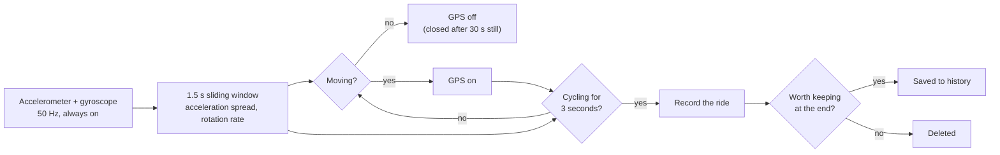
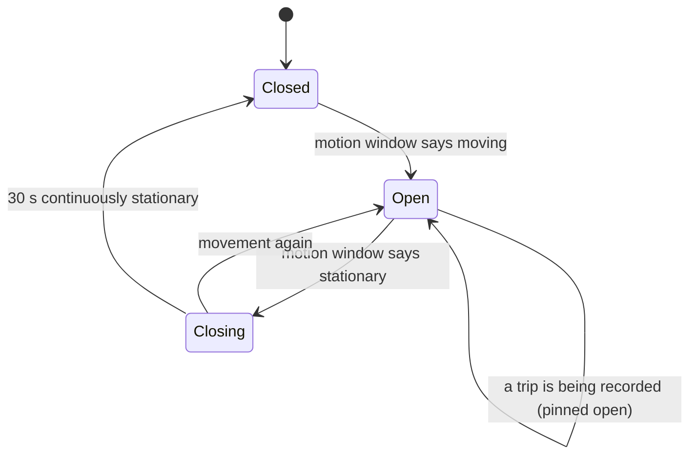
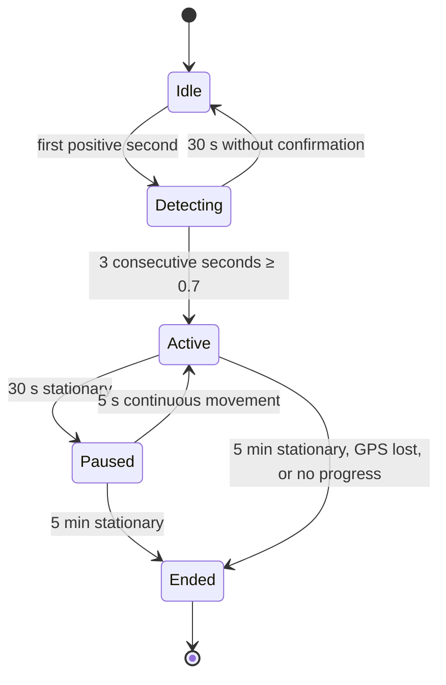
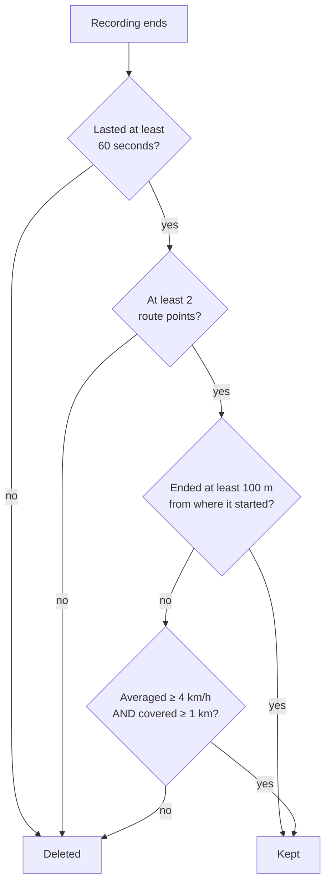

# How AutoRide works

AutoRide's job is to notice that you have started cycling, record the ride, and stop when you
arrive — without you touching the phone, and without spending the battery it would cost to leave
GPS running all day.

This page describes the mechanism as it is actually implemented, with the numbers the app really
uses. It is written against the released code, and where something is a known weakness it says so
rather than describing the design that was intended. If you want to check any of it, every rule
below is in [the source](https://github.com/glandais/autoride); the thresholds are all in one
file, `lib/core/constants/app_constants.dart`.

---

## The one idea everything follows from

GPS is the expensive part. A phone that holds a location fix all day costs a large fraction of
its battery doing it, and for the twenty-three hours you are not riding it learns nothing.

The accelerometer and gyroscope are cheap by comparison. So the app watches those continuously and
**uses them as a gate on GPS**: no movement, no GPS. Almost everything else — the delays, the
thresholds, the fact that a ride can be back-dated to before the app noticed it — follows from
that one decision.

---

## 1. What the sensors actually measure

The app samples the accelerometer and the gyroscope at 50 Hz and keeps the last **1.5 seconds** of
samples in memory. Two numbers are computed from that window, and they are the whole of the motion
evidence:

- **the spread of acceleration** — the standard deviation of the magnitude of |a|, in m/s². Not the
  average: gravity dominates the average in every orientation, so a phone lying still reads about
  9.81 m/s² and a phone on a pedalling bike reads about 10.2. The average says nothing. The
  *spread* is the road coming up through the frame.
- **the mean rotation rate** — the average magnitude of the gyroscope reading, in rad/s. A sustained
  rotation, not a flick of the wrist.

Raw readings are processed and discarded; they are not stored. (The two exceptions — the optional
diagnostic log and the optional training-data recording, both off by default and both started by
you — are described in the [Privacy Policy](legal/privacy-policy.md).)

## 2. The GPS gate

The gate is what keeps GPS off. It is driven by the same 1.5 s window, read as a three-way verdict:
*moving*, *stationary*, or *not enough information yet*.

A phone that is still counts as still only after a continuous 30 seconds — one movement re-arms it.
While a ride is being recorded the gate is pinned open, because the rules that pause and stop a trip
need speed.

Two consequences worth knowing:

- **GPS comes up after the motion, not before it.** The first fix of a departure typically arrives
  seconds after you set off, and the first *accurate* one later still.
- **On iOS, the gate is never fully closed.** With no location session at all in the process, iOS
  suspends the app within about a minute and takes the sensors with it — which would leave nothing
  running to re-open the gate. So while the gate is closed the app holds a deliberately coarse
  (3 km) system location session whose only purpose is to keep the process alive, and stops it the
  moment real GPS takes over. Those coarse positions are never recorded.

## 3. Deciding that a ride has started

Every second, the app scores the current window between 0 and 1.

**The motion score** is the average of two ramps:

| quantity | scores 0 below | reaches 1 at | stays 1 up to | scores 0 above |
|---|---|---|---|---|
| spread of \|a\| | 2.0 m/s² | 3.0 m/s² | 12 m/s² | 12 m/s² |
| mean \|gyro\| | 0.4 rad/s | 0.9 rad/s | 3.0 rad/s | 3.0 rad/s |

The ramps are deliberately asymmetric — flat all the way to the top rather than peaking in the
middle — because there is no such thing as *too much* vibration for a bicycle short of something
that is not a bicycle. A rough road must not score lower than a smooth one.

**The speed score**, when there is a usable fix, is 1 at 18 km/h and falls off either side, reaching
0 below 8 km/h and above 40 km/h. A fix counts as usable only if it is younger than 10 seconds and
accurate to better than 50 m; a fix too old or too coarse is treated as *no fix*, not as a slow one.

**The confidence** is then `0.6 × motion + 0.4 × speed` when a usable fix exists, and the motion
score alone when none does. A ride starts when the confidence reaches **0.7 in three consecutive
one-second intervals**. One interval below the threshold resets the count to zero.

In practice, the speed half rarely gets to vote: at the instant of the decision the GPS gate has
usually only just opened and no trustworthy fix has arrived yet, so the departure is decided on
motion alone. This is a real limitation, not a detail — see [§8](#8-what-this-cannot-do-yet).

If the recording that follows turns out not to be a ride, a **30-second cooldown** stops the
detector from immediately starting another one.

### Where the ride actually begins

Because GPS opens on *any* movement, the app is usually already holding a handful of fixes by the
time it decides you are cycling — often including the walk to the bike. When a ride is confirmed
those buffered fixes (up to 10 minutes, 256 points) are replayed into the recording, **cut back to
the first one at cycling speed**. The walk to the front door is dropped; the ride starts where you
actually set off, not where the detector made up its mind. If nothing in the buffer reached cycling
speed, nothing is prefixed.

## 4. During the ride

**What counts as stationary** is decided in order of trust: a fresh fix at 6 km/h or more means
moving, whatever the sensors say — a phone in a pannier is calm while the bike rolls. A fresh fix
below 3 km/h means stopped, provided the accelerometer agrees (the gyroscope is ignored here,
because a phone in a pocket turns freely while the bike stands still). Between those two speeds, or
with no usable fix, the sensors decide alone: stationary means a spread below 0.8 m/s² **and** a
mean rotation below 0.6 rad/s.

A stop of under 30 seconds — a red light — changes nothing. At 30 seconds the trip is **paused**, and
the paused time is subtracted from the ride's duration. Five minutes stationary **ends** it. A pause
lifts after 5 seconds of continuous movement.

**Which positions are kept.** Not every fix becomes part of the route. A fix is dropped if it is
accurate to worse than 50 m, if it implies a speed above 60 km/h (a GPS glitch), if it is less than
15 m from the previous kept point, or if the distance it claims to have travelled is smaller than
its own error bar — a coarse fix that has not actually gone anywhere. The distance shown for a ride
is the sum of the hops that survived all four tests.

**Two watchdogs can end a recording early.** A ride that goes 10 minutes without a single fix is
stopped (the phone left indoors, location switched off mid-ride). And a recording that has run
7 minutes without any fix ever reporting a cycling speed *and* without getting more than 100 m from
where it started is ended too — that combination is what a phone bouncing on a desk looks like, and
no real ride matches both halves of it.

## 5. What is kept, and what is thrown away

When a recording ends, it has to earn its place in your history. Recordings that fail are
**deleted**, not hidden.

The two branches exist for two different rides. The displacement branch keeps the ordinary A-to-B
ride. The speed-and-distance branch exists for the **loop** — the ride that comes home, whose net
displacement is zero and whose only evidence is that it moved fast and far. The distance term on
that second branch is what stops a slow walk that ends where it began from qualifying: GPS drift
accumulates into distance, so distance is consulted only where displacement has already said the
ride went nowhere.

If the app is killed mid-ride — by the system, by a crash, by you — the unfinished recording is
found at the next launch and closed using the route points that were already saved, then put through
exactly the same test.

### The vehicle badge

If the speeds recorded look like a motor vehicle, the ride is marked **"Looks like a vehicle"** in
your history. It is a badge and nothing more: the ride is kept, and you decide.

It was once a verdict, and that was a mistake. Over a real corpus of rides, the motion signature of
a car and of a bicycle are indistinguishable (0.298 against 0.331 on the same scale as §3), and
speed does not separate them either: a town car is slow with bursts, and a sporting cyclist is fast
continuously — the drive measured for calibration had the *lowest* top speed in the whole corpus.
When the rule could delete, it deleted 71.8 km of genuine rides in a single day. It now flags:
four or more fixes at 35 km/h or above, making up at least a quarter of the fixes with a believable
measured speed. Fast riders will be over-flagged by construction, and that is the accepted cost.

## 6. Battery

The target is under 5 % per hour of active tracking. That figure is a target, not a measurement:
it has not yet been verified on a device.

What the app does do is scale itself to the battery level. Four modes, chosen automatically:

| battery | sensors | location interval | distance filter |
|---|---|---|---|
| above 50 % | 50 Hz | 30 s | 15 m |
| 20–50 % | 40 Hz | 40 s | 20 m |
| 10–20 % | 25 Hz | 60 s | 30 m |
| below 10 % | 20 Hz | 90 s | 50 m |

The **Battery optimization** setting shifts where those boundaries sit: *Performance* stays at the
top mode until the battery is critical, *Aggressive* starts saving from 70 %, *Balanced* is the
table above.

## 7. Running in the background

Detection is only useful if it survives the phone going in a pocket, and the two platforms make
that possible in different ways.

On **Android**, the app runs a foreground service — which is why there is a permanent notification
while automatic detection is on. That notification is not decoration: it is the price Android
charges for being allowed to receive location in the background, and without it the system would
stop the app.

On **iOS**, background execution is granted opportunistically and cannot be held the same way. The
coarse location session described in §2 is what keeps the process alive between rides. Automatic
detection is, in practice, **less reliable on iOS than on Android**, and a missed departure there is
usually the operating system having suspended the app rather than the detector having failed.

Either way, a ride you start by hand ("Start ride now") does not depend on any of this.

## 8. What this cannot do yet

Stated plainly, because the alternative is you discovering it on a ride:

- **The start test cannot tell a bicycle from a pocket.** The two numbers of §1 separate a ride from
  rest *on average* — but a phone jostling in a pocket, a bag on a bus, or a few firm gestures can
  clear the same threshold for three seconds. Over one 26-hour test, 26 recordings were opened and
  4 were rides. This is why §5 exists and why it deletes rather than hides: most phantom recordings
  are thrown away at their ending, having cost you some battery and, if notifications are on, a
  notification.
- **It cannot tell a bicycle from a car either.** Nothing in the motion score distinguishes them,
  and speed has been tried and rejected (§5). Hence the badge rather than a refusal.
- **The GPS half of the start decision almost never votes**, for the timing reason in §3, so
  departures are effectively decided on motion alone today.
- **Frequency analysis is not implemented.** Pedalling has a characteristic cadence — roughly
  0.5–2 Hz — and detecting *that* rather than generic vibration is the obvious answer to the first
  two points. It is designed and not wired in.

The intended fix for all three is to classify the mode of travel from the inertial sensors with a
trained model, which is what the optional [training-data recording](legal/privacy-policy.md) is
collecting labelled data for. Until then, thresholds are kept where they are rather than tuned
tighter: a missed ride costs more than a phantom one that gets deleted.

## 9. What the settings actually change

Everything in Settings is stored, but not all of it is consumed by the pipeline described above.
As of this version:

**These change behaviour:** Automatic detection (the master switch), Battery optimization, Trip
notifications, Ongoing notification, Sound, Theme, the diagnostic-log and training-data controls,
and everything under Data Management.

**These are recorded but not yet consumed:** Detection sensitivity, Minimum trip duration,
Stationary timeout, Location accuracy, Distance filter, the Background location preference, and the
distance and speed units. Detection uses the fixed thresholds quoted on this page, the location
stream is configured from the battery mode of §6, and distances and speeds are displayed in km and
km/h regardless. They are listed here rather than quietly left ambiguous.

## 10. Where your data goes

Nowhere, unless you send it. Rides — including the full GPS route — are stored in a private database
on the phone; there is no account, no server, and no analytics. The only automatic network request
the app makes is for map tiles, and only while a map is on screen. Everything else it needs — the
typeface included — is inside the app.

The full account, including what you can export and how to erase everything, is in the
[Privacy Policy](legal/privacy-policy.md). What the app does *not* promise about its measurements is
in the [Terms of Use](legal/terms-of-service.md) — worth reading if you were thinking of relying on
a recorded distance for anything that matters.

---

*This page describes AutoRide 1.0.0. The behaviour of any released version is whatever its code
does; the code is public, and the thresholds quoted here are all in
`lib/core/constants/app_constants.dart`.*
